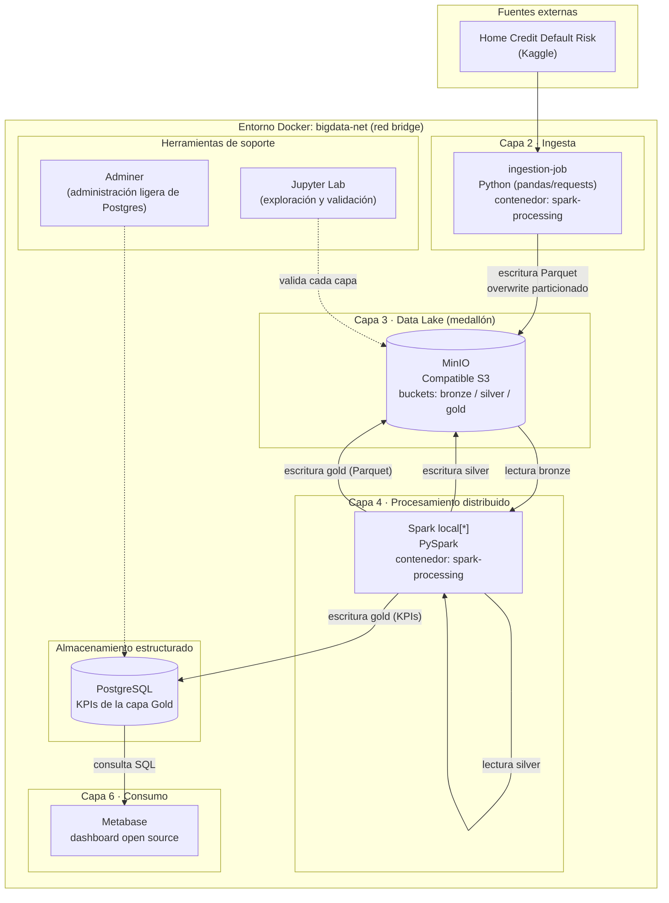
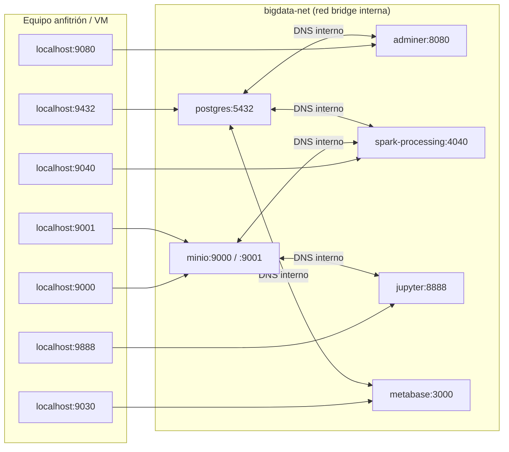
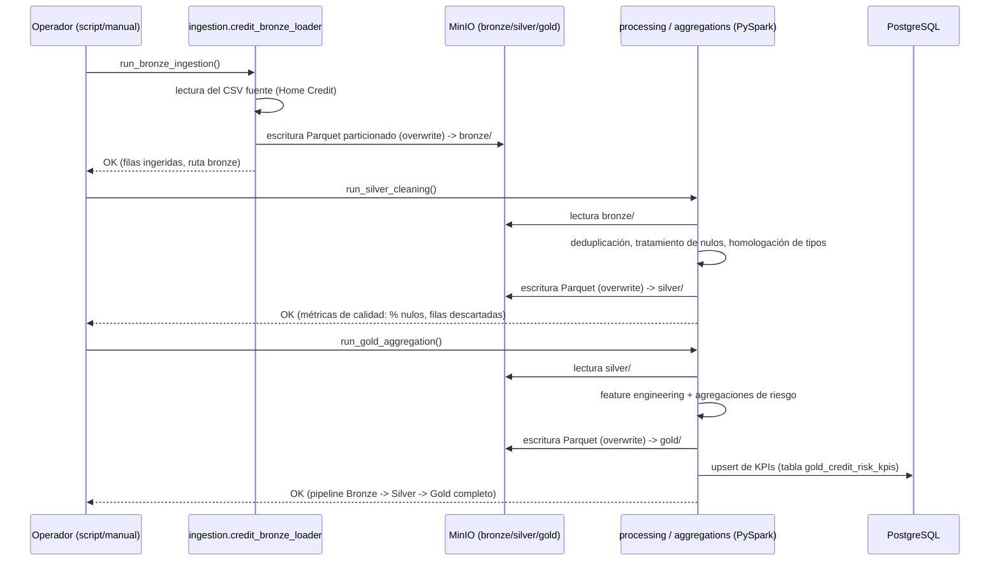
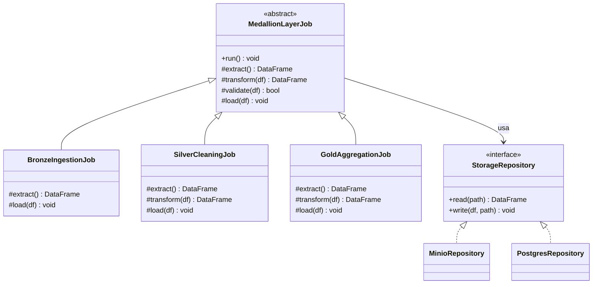

# Material de apoyo para el Capítulo II — ampliación de la sección "Arquitectura propuesta" (2.3.1)

> Nota para el equipo del proyecto (esta nota no va en la tesis): el texto que sigue está redactado para reemplazar y ampliar el esqueleto de viñetas que hoy tiene la sección **2.3.1 Desarrollo de la propuesta — Arquitectura propuesta** en `Plantilla de Proyecto de IEEE APR.docx`, una vez que la arquitectura de seis capas dejó de ser un diseño planificado y pasó a ser una implementación verificada. Continúa la numeración de tablas e ilustraciones del documento (la tesis ya llega hasta Tabla 2 e Ilustración 1). Este documento incluye los diagramas fuente en Mermaid, dentro de un bloque de código, en el lugar exacto donde va cada figura — hay que exportar cada bloque a imagen (PNG/SVG, por ejemplo con el editor en mermaid.live o la extensión de Mermaid de VS Code) y pegarlo en el `.docx` justo debajo de su leyenda "Ilustración N.", que es la convención que ya usa el resto del documento. No se debe pegar el bloque de código Mermaid tal cual en la tesis. Los ocho estudios citados como `[1]`–`[8]` son los mismos ya referenciados en el Capítulo I; no se introducen fuentes nuevas salvo que el tutor lo pida.

---

## 2.3.1 Arquitectura propuesta e implementación técnica

El diseño conceptual de seis capas descrito en la sección anterior fue llevado a un entorno de ejecución real durante la fase de desarrollo tecnológico del proyecto, con el propósito de demostrar que la arquitectura no solo resulta coherente desde el punto de vista teórico, sino que efectivamente es capaz de integrar y procesar información asociada al riesgo crediticio de principio a fin. La implementación se realizó sobre un entorno on-premise, mediante contenedores Docker, para mantener el control total del ecosistema tecnológico sin incurrir en costos ni dependencias de proveedores de nube, decisión que resulta coherente con el carácter académico del proyecto y con la necesidad de que la solución pueda ser replicada por cualquier institución interesada, independientemente de su infraestructura disponible.

Como fuente de datos principal se utilizó el conjunto *Home Credit Default Risk*, compuesto por 307 511 solicitudes de crédito históricas y anonimizadas, correspondiente a la tabla `application_train` del repositorio original en Kaggle. Aunque el diagnóstico del Capítulo I contempla la incorporación de fuentes macroeconómicas complementarias —Banco Mundial, Fondo Monetario Internacional, FRED, Yahoo Finance, Nasdaq Data Link, BIS y EIA—, la primera iteración de la arquitectura se acotó deliberadamente al dataset crediticio, de modo que fuera posible validar el comportamiento completo del pipeline Bronze-Silver-Gold antes de sumar la complejidad de integrar fuentes externas con formatos y frecuencias de actualización heterogéneas. Esta decisión responde a un criterio de desarrollo incremental habitual en proyectos de ingeniería de datos: primero se demuestra que el esqueleto de la arquitectura funciona correctamente con una fuente controlada, y solo después se generaliza a fuentes adicionales, evitando que un problema de integración externa oculte errores en el diseño mismo del pipeline.

A continuación se describe cómo quedó implementada cada una de las seis capas, junto con los componentes tecnológicos empleados y la justificación de cada elección.

### Capa de ingesta

La ingesta se resolvió mediante un módulo desarrollado en Python que lee el archivo fuente y lo transfiere hacia el Data Lake sin aplicar ninguna transformación sobre su contenido, de manera que el dato crudo quede disponible como referencia de auditoría en cualquier etapa posterior del proyecto. Esta decisión de no tocar el dato en su primer contacto con la arquitectura es uno de los principios centrales de las arquitecturas de tipo medallón y resulta particularmente relevante en un dominio como el financiero, donde la trazabilidad de la información puede ser tan importante como el resultado del análisis en sí [1].

### Data Lake y arquitectura Medallón

El almacenamiento del Data Lake se implementó con MinIO, un servidor de objetos compatible con el protocolo S3 de Amazon Web Services. La elección de MinIO, en lugar de un sistema de archivos convencional, responde a que Spark necesita leer y escribir datos en paralelo, y los protocolos de almacenamiento de objetos están diseñados precisamente para ese patrón de acceso; adicionalmente, al ser compatible con S3, cualquier migración futura de la arquitectura hacia un proveedor de nube no exigiría reescribir el código de lectura y escritura de datos, sino únicamente cambiar el punto de conexión. Dentro de MinIO se crearon tres espacios de almacenamiento —bronze, silver y gold— que corresponden exactamente a las tres etapas de la arquitectura Medallón definida en el diagnóstico, y todos los datos se almacenan en formato Parquet, tal como lo exige el documento base del proyecto.

En la capa Bronze el dato ingresa sin alteraciones. En la capa Silver, un proceso desarrollado sobre PySpark elimina registros duplicados, trata valores faltantes y homologa los tipos de dato entre columnas, dejando un conjunto de datos limpio pero todavía sin agregaciones de negocio. Finalmente, en la capa Gold se construyen variables derivadas —como la edad del solicitante o el ratio entre el monto del crédito solicitado y el ingreso declarado— y se calculan los indicadores agregados que alimentan tanto los modelos analíticos como los tableros de consumo. Cada una de estas tres escrituras se realiza en modo `overwrite` sobre particiones definidas, de manera que volver a ejecutar el pipeline completo no genera registros duplicados ni resultados inconsistentes; esta propiedad, conocida como idempotencia, fue un requisito de diseño establecido desde el inicio del desarrollo, dado que un pipeline de datos que no puede repetirse de forma segura introduce un riesgo operativo difícil de justificar en un contexto financiero.

### Procesamiento distribuido

El procesamiento se implementó con Apache Spark, a través de su interfaz PySpark, ejecutado en modo local (`local[*]`) dentro de un único contenedor. Cabe aclarar que el requisito de "procesamiento distribuido" planteado en el diagnóstico no exige necesariamente un clúster de varios nodos físicos; Spark en modo local conserva exactamente la misma arquitectura interna de particionamiento de datos, planificación de tareas y ejecución paralela que un clúster con varios nodos, y es el propio motor —no la cantidad de máquinas— el que le otorga a la solución su capacidad de escalar. Dado que el volumen del dataset utilizado en esta primera iteración (poco más de 300 mil registros) no exige el uso de varios nodos físicos para completarse en tiempos razonables, se optó por un despliegue de un solo nodo, dejando documentada la migración a un clúster real de tipo *master–worker* como una línea de trabajo futura, condicionada a la disponibilidad de hardware de la institución que adopte la arquitectura. Esta decisión permitió reducir de forma significativa el consumo de memoria del entorno completo sin sacrificar la validez arquitectónica de la propuesta.

### Almacenamiento estructurado y capa analítica

Los resultados agregados de la capa Gold —es decir, los indicadores de riesgo ya calculados— se replican además en una base de datos PostgreSQL, en una tabla relacional (`gold_credit_risk_kpis`) pensada para ser consumida directamente por herramientas de inteligencia de negocio. Esta decisión de mantener dos representaciones del mismo resultado, una en Parquet dentro de MinIO y otra en una tabla relacional, no es redundante: el Data Lake conserva el detalle completo para análisis exploratorio y para el eventual entrenamiento de modelos de aprendizaje automático, mientras que la base relacional ofrece una interfaz SQL simple, sin necesidad de controladores especializados, para cualquier herramienta de visualización que se conecte a la arquitectura.

### Capa de consumo

Para la capa de consumo se implementó Metabase, una herramienta de tableros de código abierto, que se conecta directamente a la tabla de indicadores en PostgreSQL. Se evaluó inicialmente Power BI, mencionado en el diagnóstico como referencia de herramienta de visualización; sin embargo, dado que el resto de la arquitectura se construyó íntegramente con componentes de código abierto ejecutados dentro de Docker, se prefirió una alternativa que pudiera desplegarse dentro del mismo entorno on-premise, sin depender de licencias comerciales ni de un sistema operativo distinto al del resto del ecosistema. Metabase permite construir gráficos y paneles ejecutivos sobre la tabla de KPIs mediante una interfaz de arrastrar y soltar, sin necesidad de escribir consultas SQL, lo que facilita que perfiles no técnicos —analistas de riesgo o directivos— puedan explorar los resultados de la arquitectura de forma autónoma.

La Ilustración 2 resume la arquitectura completa y la forma en que los componentes descritos se comunican entre sí dentro del entorno Docker.

*(Ilustración 2. Arquitectura de la solución implementada, por capas y componentes tecnológicos.)*

## 2.3.1.1 Infraestructura de despliegue

Toda la arquitectura descrita se orquesta mediante Docker y Docker Compose, bajo un único archivo de definición que agrupa los seis servicios principales (MinIO, PostgreSQL, Spark, Jupyter, Adminer y Metabase) en un mismo proyecto lógico. Esta decisión de infraestructura responde a un objetivo concreto planteado por el equipo revisor del proyecto: contar con una arquitectura de herramientas reproducible, capaz de levantarse en cualquier máquina con un único comando, sin que el proceso de instalación dependa de la configuración particular de cada equipo. Los contenedores se comunican entre sí a través de una red privada de tipo *bridge*, creada exclusivamente para este proyecto, y se resuelven unos a otros por nombre de servicio en lugar de por dirección IP, de manera que el mismo archivo de orquestación se comporta de forma idéntica sin importar en qué máquina se ejecute.

La persistencia de la información se resolvió mediante tres volúmenes de Docker independientes: uno para los archivos Parquet del Data Lake, otro para la base de datos PostgreSQL y uno adicional para la configuración interna de Metabase (usuarios, conexiones y tableros ya construidos). Esta separación permite que los contenedores en sí sean completamente desechables —pueden eliminarse y recrearse sin pérdida de información— porque todo el estado relevante del sistema reside en estos tres volúmenes y no en el sistema de archivos interno de cada contenedor.

En cuanto a la exposición de servicios hacia el equipo anfitrión, se estableció como criterio de diseño evitar el puerto 8080, por ser un puerto de uso frecuente en otras herramientas (servidores de aplicaciones, proxys), y concentrar en su lugar todos los servicios en el rango 90xx. La Ilustración 3 muestra de forma esquemática esta relación entre los puertos expuestos al equipo anfitrión y los puertos internos con los que cada contenedor se identifica dentro de la red privada del proyecto, y la Tabla 3 detalla ese mismo mapeo en formato tabular, junto con la función de cada servicio.

*(Ilustración 3. Diagrama de red y puertos del entorno Docker.)*

Tabla 3. Mapeo de puertos entre el equipo anfitrión y los contenedores de la arquitectura.

| Servicio | Puerto interno | Puerto expuesto | Función dentro de la arquitectura |
|---|---|---|---|
| MinIO (API S3) | 9000 | 9000 | Acceso programático a los buckets bronze, silver y gold desde Spark |
| MinIO (consola web) | 9001 | 9001 | Exploración visual del contenido del Data Lake |
| PostgreSQL | 5432 | 9432 | Conexión de Spark, Adminer y Metabase a la tabla de KPIs |
| Adminer | 8080 | 9080 | Inspección directa de la base de datos sin instalar software adicional |
| Metabase | 3000 | 9030 | Capa de consumo: construcción de tableros sobre los indicadores de riesgo |
| Interfaz web de Spark | 4040 | 9040 | Monitoreo en tiempo real de las tareas de procesamiento distribuido |
| Jupyter Lab | 8888 | 9888 | Exploración manual y validación del contenido de cada capa |

Un aspecto que se consideró explícitamente durante la implementación fue la gestión de credenciales. Ningún usuario ni contraseña se encuentra escrito de forma literal dentro del archivo de orquestación; todos los valores sensibles provienen de variables de entorno definidas en un archivo local que nunca se incorpora al repositorio del proyecto, y que se genera a partir de una plantilla de ejemplo sin datos reales. Esta práctica, estándar en el desarrollo de software, adquiere particular relevancia en un proyecto que manipula información asociada al comportamiento financiero de personas, incluso cuando el conjunto de datos utilizado ya se encuentra anonimizado por el propio proveedor.

## 2.3.1.2 Comportamiento del pipeline y garantía de idempotencia

El flujo completo de datos se dispara mediante un único punto de entrada que ejecuta, en orden, las tres etapas de la arquitectura Medallón: primero la ingesta hacia la capa Bronze, luego la limpieza hacia la capa Silver y finalmente la agregación hacia la capa Gold, con la escritura simultánea de los indicadores finales en la base de datos relacional. La Ilustración 4 representa este comportamiento como un diagrama de secuencia, útil para visualizar no solo el orden de ejecución sino también la interacción entre cada módulo de procesamiento y los distintos repositorios de almacenamiento.

*(Ilustración 4. Comportamiento del pipeline Bronze–Silver–Gold, desde la ingesta hasta la disponibilidad de los indicadores de riesgo.)*

Una de las decisiones de diseño que se sostuvo de manera consistente a lo largo de toda la implementación fue la idempotencia de las escrituras: cada etapa reemplaza por completo la partición correspondiente en lugar de acumular datos sobre ejecuciones anteriores. La razón detrás de esta decisión no es únicamente técnica, sino también metodológica: al tratarse de un proyecto que será evaluado y potencialmente demostrado en vivo ante un tribunal, resultaba indispensable que el pipeline pudiera ejecutarse repetidas veces sin correr el riesgo de duplicar registros o de generar resultados distintos entre una corrida y otra, lo que habría comprometido la confiabilidad de cualquier verificación posterior.

## 2.3.1.3 Decisiones de diseño de software

Más allá de la selección de herramientas, la implementación incorporó un conjunto de decisiones de diseño de software orientadas a que el código resultante fuera mantenible y verificable, sin incurrir en una complejidad innecesaria para el alcance de esta primera iteración. La sesión de Spark, por ejemplo, se construye a través de una única función que garantiza que exista solamente una instancia activa por proceso, evitando el sobrecosto de crear e inicializar sesiones repetidas en cada módulo del pipeline. De manera similar, el acceso a MinIO y a PostgreSQL se aisló detrás de una capa de abstracción propia, de modo que el código de negocio —las reglas de limpieza y las agregaciones— no dependa directamente de las bibliotecas de bajo nivel utilizadas para conectarse a cada sistema, lo cual además facilita que ese código pueda probarse de forma automatizada sin necesidad de tener la infraestructura completa levantada.

Las tres etapas de la arquitectura Medallón —Bronze, Silver y Gold— comparten además una misma estructura de ejecución (extracción, transformación, validación y carga), definida una sola vez y reutilizada por cada capa, de manera que el comportamiento común del pipeline queda centralizado y el código específico de cada etapa se limita estrictamente a lo que la diferencia de las demás. Este tipo de decisiones, más cercanas a la ingeniería de software que a la ciencia de datos propiamente dicha, resultan relevantes en el contexto de esta investigación porque sostienen la afirmación de que la arquitectura propuesta no es solamente un conjunto de herramientas conectadas entre sí, sino una solución diseñada con criterios de mantenibilidad que permitirían a un equipo distinto continuar su desarrollo sin necesidad de reescribirla desde cero.

La Ilustración 5 sintetiza estas decisiones en un diagrama de clases, en el que la clase abstracta `MedallionLayerJob` concentra el comportamiento común de las tres etapas del pipeline y cada capa concreta —Bronze, Silver y Gold— únicamente sobrescribe los pasos que le son propios, apoyándose en una interfaz de repositorio que oculta si el dato finalmente se lee o se escribe en MinIO o en PostgreSQL.

*(Ilustración 5. Diagrama de clases de los patrones de diseño aplicados en la implementación del pipeline.)*

La Tabla 5 resume, patrón por patrón, dónde se aplicó cada uno dentro del código y qué problema concreto resuelve, como complemento textual al diagrama anterior.

Tabla 5. Patrones de diseño aplicados en la implementación.

| Patrón | Ubicación en el código | Justificación |
|---|---|---|
| *Singleton* (mediante función cacheada) | `common/session.py` — `get_spark_session()` | Garantiza una única `SparkSession` por proceso, evitando el sobrecosto de crear sesiones repetidas en cada módulo |
| *Factory Method* | `ingestion/` — selector del *loader* correspondiente a cada fuente | Permite incorporar nuevas fuentes de datos sin modificar el orquestador del pipeline |
| *Template Method* | `processing/` y `aggregations/` — clase base `MedallionLayerJob` | Bronze, Silver y Gold comparten el mismo esqueleto de ejecución; el código específico de cada capa queda aislado y es testeable de forma independiente |
| *Strategy* | Reglas de limpieza en la capa Silver | Permite cambiar la estrategia de imputación de nulos por tipo de columna sin reescribir el job completo |
| *Repository* | `common/storage.py` — abstracciones para MinIO y PostgreSQL | Desacopla el código de negocio de las bibliotecas de bajo nivel, facilitando pruebas automatizadas |
| Escritura idempotente (patrón arquitectónico) | Todas las escrituras a MinIO y PostgreSQL | Garantiza que el reprocesamiento de Bronze→Silver→Gold no duplique ni corrompa datos |

## 2.3.1.4 Seguridad de la infraestructura

Dado que la arquitectura manipula información de naturaleza financiera, se realizó una revisión explícita de las condiciones de seguridad del entorno implementado, con el propósito de dejar constancia de qué aspectos ya se encuentran resueltos y cuáles quedan pendientes en caso de que la solución trascienda su condición actual de prueba de concepto de un solo equipo. Entre los aspectos verificados se confirmó que ningún archivo de credenciales fue incorporado al repositorio en ningún momento del historial del proyecto, que las contraseñas por defecto se encuentran marcadas de forma explícita para forzar su reemplazo antes de cualquier uso más allá del entorno de pruebas, y que la red privada creada para el proyecto aísla el tráfico entre contenedores del resto de servicios que pudieran estar corriendo en la misma máquina.

Al mismo tiempo, la revisión identificó limitaciones propias de un entorno de una sola máquina orientado a demostrar una arquitectura, y no a operar en producción: los servicios no restringen su acceso a conexiones locales, el entorno de Jupyter Lab no exige autenticación, y no existe cifrado en el tráfico entre los distintos componentes. Ninguna de estas condiciones representa un riesgo inmediato mientras la arquitectura se ejecute dentro de una red privada sin salida a Internet, que es el escenario en el que fue validada; sin embargo, se documentan de forma explícita como trabajo pendiente, junto con las medidas que correspondería aplicar —restricciones de firewall, autenticación de los entornos de desarrollo y un proxy con cifrado TLS delante de los servicios— si en el futuro la arquitectura se despliega en un contexto que exceda un único equipo controlado por el propio investigador.

## 2.3.1.5 Dimensionamiento de recursos y portabilidad entre equipos

Uno de los requisitos que se estableció desde el inicio de la implementación fue que la arquitectura pudiera ejecutarse en una sola máquina, sin exigir infraestructura especializada, de manera que cualquier institución interesada en replicarla no dependiera de un centro de datos propio. Bajo ese criterio, se definieron límites de memoria y procesamiento para cada uno de los seis servicios, resumidos en la Tabla 4, que en conjunto exigen aproximadamente 6,3 GB de memoria y 4,75 núcleos de procesamiento, por lo que se recomienda un equipo con al menos 10 GB de memoria disponible y 4 núcleos para una ejecución sin fricción.

Tabla 4. Requisitos de cómputo estimados por servicio de la arquitectura.

| Servicio | Memoria asignada | Procesamiento asignado | Observación |
|---|---|---|---|
| MinIO | 512 MB | 0,5 núcleos | Suficiente para el volumen de datos manejado en esta iteración |
| PostgreSQL | 256 MB | 0,5 núcleos | Almacena únicamente los indicadores agregados de la capa Gold |
| Spark | 3 GB | 2 núcleos | Componente de mayor consumo del entorno completo |
| Jupyter Lab | 1 GB | 0,5 núcleos | Utilizado para la exploración y validación manual de cada capa |
| Adminer | 64 MB | 0,25 núcleos | Interfaz liviana, sin procesos en segundo plano |
| Metabase | 1,5 GB | 1 núcleo | Segundo mayor consumidor de memoria del entorno |

En equipos con menos de 8 GB de memoria disponibles para Docker, la propia configuración permite reducir el número de núcleos asignados a Spark sin modificar la arquitectura, únicamente ajustando variables de entorno, lo cual demuestra que el dimensionamiento propuesto es un parámetro de despliegue y no una condición estructural de la solución.

Un punto que se consideró relevante dejar documentado, dado que el desarrollo del proyecto se realizó en un equipo con procesador de arquitectura ARM (Apple Silicon), es la portabilidad de la arquitectura hacia equipos con procesadores de arquitectura distinta, como los que predominan en equipos con Windows o en servidores Linux convencionales (arquitectura x86-64). Todas las imágenes de software utilizadas en el entorno corresponden a distribuciones oficiales que ya incluyen soporte nativo para ambas arquitecturas, por lo que no se identificó ninguna limitación de compatibilidad atribuible al tipo de procesador. El único inconveniente observado durante el desarrollo estuvo relacionado con una restricción de permisos propia del sistema operativo macOS sobre el software de virtualización de contenedores, ajena por completo al motor de contenedores en sí, y que no tiene equivalente en Windows ni en distribuciones de Linux. La arquitectura fue validada de manera completa sobre una máquina virtual con Linux (Ubuntu 22.04 LTS), entorno en el que no se presentó ningún inconveniente de esta naturaleza, lo que respalda que la solución puede replicarse en distintos sistemas operativos sin comprometer su comportamiento.

## 2.3.1.6 Validación de la implementación

La arquitectura descrita fue validada de extremo a extremo sobre una máquina virtual con Ubuntu 22.04 LTS, siguiendo un procedimiento de verificación por componente que incluyó: la confirmación de que los tres espacios de almacenamiento del Data Lake contuvieran la información esperada en cada etapa, la revisión de la tabla de indicadores en PostgreSQL, la construcción de un tablero funcional en Metabase conectado a esos mismos indicadores, y la observación del comportamiento del motor de procesamiento distribuido durante una ejecución completa del pipeline a través de su interfaz de monitoreo. El pipeline se ejecutó de manera automática al momento de levantar el entorno y, adicionalmente, de forma manual en repetidas ocasiones para confirmar el comportamiento idempotente descrito en la sección 2.3.1.2, sin que se observaran diferencias entre una ejecución y otra.

Esta validación permite sostener que la arquitectura de seis capas propuesta en el diagnóstico no permanece únicamente en un nivel conceptual, sino que fue efectivamente construida, desplegada y verificada como un sistema funcional, capaz de integrar la fuente de datos crediticia definida para esta primera iteración y de dejar sentadas las condiciones técnicas necesarias para incorporar, en una etapa posterior, las fuentes macroeconómicas complementarias y los modelos de aprendizaje automático contemplados en el objetivo general del proyecto.

---
*Fuente de este material: implementación técnica documentada en `docs/03-arquitectura-poc-mvp.md`, `docs/05-guia-componentes-defensa.md`, `docs/06-infraestructura-docker.md` y `docs/04-manual-usuario.md`. Los ocho estudios citados corresponden a las referencias `[1]`–`[8]` ya incluidas en la sección de Referencias del documento de tesis. Este documento aporta las Ilustraciones 2 a 5 y las Tablas 3 a 5, continuando la numeración de la Ilustración 1 y la Tabla 2 ya existentes en la tesis.*
